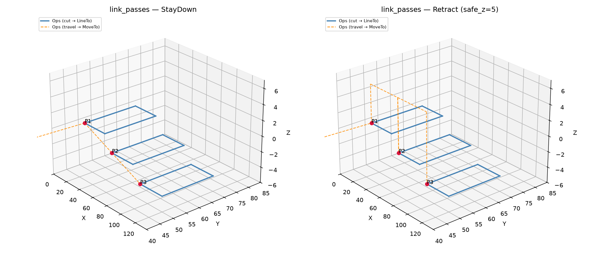

## LinkStrategy

## Functions

### `find_pass_entry()`

```python
find_pass_entry(ops: ops.Ops) -> tuple[float, float, float] | None
```

Find the entry point of an Ops sequence.

Scans for the first travel (MoveTo) endpoint, falling back to the first moving command endpoint.

| Parameter    | Type                                     | Description                                        |
| ------------ | ---------------------------------------- | -------------------------------------------------- |
| `ops`        | `ops.Ops`                                | An **~raygeo.ops.Ops** container.                  |
| _Returns_    | `tuple[float, float, float] &#124; None` | `(x, y, z)` or `None` if no moving commands exist. |
| _Complexity_ |                                          | O(n) where n = number of commands                  |


*Entry and exit points from find_pass_entry / find_pass_exit*

### `find_pass_exit()`

```python
find_pass_exit(ops: ops.Ops) -> tuple[float, float, float] | None
```

Find the exit point of an Ops sequence.

Scans backwards for the last moving command endpoint.

| Parameter    | Type                                     | Description                                        |
| ------------ | ---------------------------------------- | -------------------------------------------------- |
| `ops`        | `ops.Ops`                                | An **~raygeo.ops.Ops** container.                  |
| _Returns_    | `tuple[float, float, float] &#124; None` | `(x, y, z)` or `None` if no moving commands exist. |
| _Complexity_ |                                          | O(n) where n = number of commands                  |

### `link_passes()`

```python
link_passes(
    passes: list[ops.Ops],
    safe_z: float,
    strategy: str | LinkStrategy,
) -> ops.Ops
```

Join ordered machining passes into a single Ops sequence.

The first pass is emitted as-is; subsequent passes are prefixed with travel moves according to
*strategy*:

- `"retract"` / `LinkStrategy.RETRACT` — retract to *safe_z*, move XY at that height, then descend
  to the next pass start Z.
- `"stay_down"` / `LinkStrategy.STAY_DOWN` — move directly from the previous pass end to the next
  pass start without retracting.

| Parameter    | Type                      | Description                                     |
| ------------ | ------------------------- | ----------------------------------------------- |
| `passes`     | `list[ops.Ops]`           | Ordered list of **~raygeo.ops.Ops** passes.     |
| `safe_z`     | `float`                   | Z height for retract moves (mm).                |
| `strategy`   | `str &#124; LinkStrategy` | Linking strategy.                               |
| _Returns_    | `ops.Ops`                 | A single **~raygeo.ops.Ops** container.         |
| _Complexity_ |                           | O(n) where n = total commands across all passes |



*Three passes linked with StayDown vs Retract strategies*
