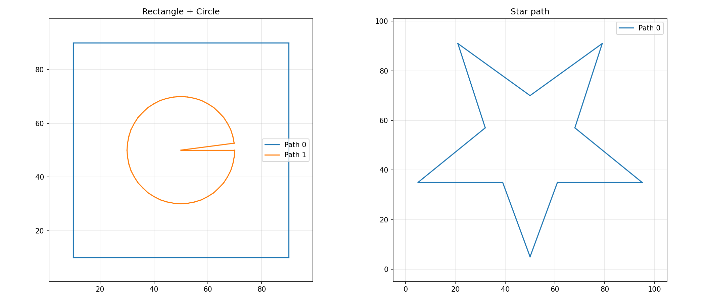

_SVG path data parsed into geometries_

## SvgMetadata

SVG document metadata extracted from an SVG string.

Provides width, height, units and viewBox values parsed from the root `<svg>` element.

### `height`

```python
height: Optional[float]
```

Document height as a numeric value (may be `None` if not set).

### `height_unit`

```python
height_unit: str
```

Unit string for the height attribute.

### `viewbox`

```python
viewbox: Optional[tuple[float, float, float, float]]
```

ViewBox as `(min_x, min_y, width, height)`, or `None`.

### `width`

```python
width: Optional[float]
```

Document width as a numeric value (may be `None` if not set).

### `width_unit`

```python
width_unit: str
```

Unit string for the width attribute (e.g. `"mm"`, `"in"`, `"px"`).

### `height_mm()`

```python
height_mm(dpi: float = 96.0) -> Optional[float]
```

Convert the document height to millimetres.

| Parameter    | Type              | Description                                              |
| ------------ | ----------------- | -------------------------------------------------------- |
| `dpi`        | `float = 96.0`    | Pixels-per-inch for px/unitless conversion (default 96). |
| _Returns_    | `Optional[float]` |                                                          |
| _Complexity_ |                   | O(1)                                                     |

### `height_px()`

```python
height_px(dpi: float = 96.0) -> Optional[float]
```

Convert the document height to pixels.

| Parameter    | Type              | Description                                  |
| ------------ | ----------------- | -------------------------------------------- |
| `dpi`        | `float = 96.0`    | Pixels-per-inch for conversion (default 96). |
| _Returns_    | `Optional[float]` |                                              |
| _Complexity_ |                   | O(1)                                         |

### `width_mm()`

```python
width_mm(dpi: float = 96.0) -> Optional[float]
```

Convert the document width to millimetres.

| Parameter    | Type              | Description                                              |
| ------------ | ----------------- | -------------------------------------------------------- |
| `dpi`        | `float = 96.0`    | Pixels-per-inch for px/unitless conversion (default 96). |
| _Returns_    | `Optional[float]` |                                                          |
| _Complexity_ |                   | O(1)                                                     |

### `width_px()`

```python
width_px(dpi: float = 96.0) -> Optional[float]
```

Convert the document width to pixels.

| Parameter    | Type              | Description                                  |
| ------------ | ----------------- | -------------------------------------------- |
| `dpi`        | `float = 96.0`    | Pixels-per-inch for conversion (default 96). |
| _Returns_    | `Optional[float]` |                                              |
| _Complexity_ |                   | O(1)                                         |

## Functions

### `extract_svg_metadata()`

```python
extract_svg_metadata(svg_str: str) -> SvgMetadata
```

Extract width, height, units and viewBox from an SVG string.

| Parameter    | Type          | Description                                                                               |
| ------------ | ------------- | ----------------------------------------------------------------------------------------- |
| `svg_str`    | `str`         | SVG document as a string.                                                                 |
| _Returns_    | `SvgMetadata` | SvgMetadata instance with width, height, width_unit, height_unit, and viewbox attributes. |
| _Complexity_ |               | O(n) where n = size of SVG document                                                       |

### `geometry_to_svg_path()`

```python
geometry_to_svg_path(geometry: Geometry, width: int, height: int) -> str
```

Convert a normalized Geometry to an SVG path d attribute string.

The geometry coordinates should be in normalized [0, 1] space. Coordinates are scaled to pixel
dimensions via width and height, with the Y axis flipped (SVG Y increases downward).

| Parameter    | Type       | Description                                    |
| ------------ | ---------- | ---------------------------------------------- |
| `geometry`   | `Geometry` | A Geometry object with normalized coordinates. |
| `width`      | `int`      | Target pixel width.                            |
| `height`     | `int`      | Target pixel height.                           |
| _Returns_    | `str`      | SVG path d attribute string.                   |
| _Complexity_ |            | O(n) where n = number of commands              |

### `parse_svg_length()`

```python
parse_svg_length(length_str: str) -> tuple[float, str]
```

Parse an SVG length string into a (value, unit) tuple.

Supports: mm, cm, in, pt, pc, px. Unitless values default to 'px'.

| Parameter    | Type                | Description                                      |
| ------------ | ------------------- | ------------------------------------------------ |
| `length_str` | `str`               | SVG length string (e.g. '10mm', '2.5in', '100'). |
| _Returns_    | `tuple[float, str]` | Tuple of (value, unit).                          |
| _Complexity_ |                     | O(1)                                             |

### `parse_svg_path_data()`

```python
parse_svg_path_data(
    path_data: str,
    transform: numpy.NDArray[numpy.float64] | None = None,
    scale_x: float = 1,
    scale_y: float = 1,
) -> list[Geometry]
```

Parse an SVG path d attribute into a list of Geometry objects.

Supports M/m, L/l, H/h, V/v, C/c, Z/z commands. Cubic Bezier curves are flattened to line segments
(20 steps).

| Parameter    | Type                                              | Description                                             |
| ------------ | ------------------------------------------------- | ------------------------------------------------------- |
| `path_data`  | `str`                                             | SVG path d attribute string.                            |
| `transform`  | `numpy.NDArray[numpy.float64] &#124; None = None` | 3x3 affine transformation matrix, or None for identity. |
| `scale_x`    | `float = 1`                                       | X-axis scale factor for coordinate transform.           |
| `scale_y`    | `float = 1`                                       | Y-axis scale factor for coordinate transform.           |
| _Returns_    | `list[Geometry]`                                  | List of Geometry objects, one per subpath.              |
| _Complexity_ |                                                   | O(n) where n = length of path data                      |

### `parse_svg_transform()`

```python
parse_svg_transform(transform_str: str) -> numpy.NDArray[numpy.float64]
```

Parse an SVG transform attribute string (translate only).

Returns a 3x3 identity matrix with translation applied.

| Parameter       | Type                           | Description                                      |
| --------------- | ------------------------------ | ------------------------------------------------ |
| `transform_str` | `str`                          | SVG transform attribute value.                   |
| _Returns_       | `numpy.NDArray[numpy.float64]` | 3x3 affine transformation matrix as numpy array. |
| _Complexity_    |                                | O(1)                                             |

### `svg_length_to_mm()`

```python
svg_length_to_mm(length_str: str, dpi: float = 96) -> float
```

Parse an SVG length string and convert to millimetres.

| Parameter    | Type         | Description                                                   |
| ------------ | ------------ | ------------------------------------------------------------- |
| `length_str` | `str`        | SVG length string (e.g. '10mm', '2.5in', '100').              |
| `dpi`        | `float = 96` | Pixels per inch used for px/unitless conversion (default 96). |
| _Returns_    | `float`      | Length in millimetres.                                        |
| _Complexity_ |              | O(1)                                                          |

### `svg_length_to_px()`

```python
svg_length_to_px(length_str: str, dpi: float = 96) -> float
```

Parse an SVG length string and convert to pixels.

| Parameter    | Type         | Description                                                   |
| ------------ | ------------ | ------------------------------------------------------------- |
| `length_str` | `str`        | SVG length string (e.g. '10mm', '2.5in', '100').              |
| `dpi`        | `float = 96` | Pixels per inch used for px/unitless conversion (default 96). |
| _Returns_    | `float`      | Length in pixels.                                             |
| _Complexity_ |              | O(1)                                                          |

### `svg_string_to_geometries()`

```python
svg_string_to_geometries(
    svg_str: str,
    scale_x: float = 1,
    scale_y: float = 1,
) -> list[Geometry]
```

Parse an SVG string and extract all path elements as Geometry objects.

Recursively traverses the SVG XML tree, extracting d attributes from path elements and converting
them to Geometry.

| Parameter    | Type             | Description                                      |
| ------------ | ---------------- | ------------------------------------------------ |
| `svg_str`    | `str`            | SVG document as a string.                        |
| `scale_x`    | `float = 1`      | X-axis scale factor for coordinate transform.    |
| `scale_y`    | `float = 1`      | Y-axis scale factor for coordinate transform.    |
| _Returns_    | `list[Geometry]` | List of Geometry objects from all path elements. |
| _Complexity_ |                  | O(n) where n = size of SVG document              |

### `svg_string_to_geometries_by_layer()`

```python
svg_string_to_geometries_by_layer(
    svg_str: str,
    scale_x: float = 1,
    scale_y: float = 1,
) -> list[tuple[str, list[Geometry]]]
```

Extract geometries grouped by top-level <g> layer.

Returns a list of (layer_id, geometries) tuples. Only top-level <g> elements with an id attribute
are treated as layers.

| Parameter    | Type                               | Description                                   |
| ------------ | ---------------------------------- | --------------------------------------------- |
| `svg_str`    | `str`                              | SVG document as a string.                     |
| `scale_x`    | `float = 1`                        | X-axis scale factor for coordinate transform. |
| `scale_y`    | `float = 1`                        | Y-axis scale factor for coordinate transform. |
| _Returns_    | `list[tuple[str, list[Geometry]]]` | List of (layer_id, geometry_list) tuples.     |
| _Complexity_ |                                    | O(n) where n = size of SVG document           |

### `svg_string_to_geometry()`

```python
svg_string_to_geometry(
    svg_str: str,
    scale_x: float = 1,
    scale_y: float = 1,
) -> Geometry
```

Parse an SVG string and merge all subpaths into a single Geometry.

Like svg_string_to_geometries but returns one combined Geometry instead of a list, avoiding a
Python-side merge loop.

| Parameter    | Type        | Description                                   |
| ------------ | ----------- | --------------------------------------------- |
| `svg_str`    | `str`       | SVG document as a string.                     |
| `scale_x`    | `float = 1` | X-axis scale factor for coordinate transform. |
| `scale_y`    | `float = 1` | Y-axis scale factor for coordinate transform. |
| _Returns_    | `Geometry`  | A single Geometry containing all paths.       |
| _Complexity_ |             | O(n) where n = size of SVG document           |

### `svg_string_to_geometry_by_layer()`

```python
svg_string_to_geometry_by_layer(
    svg_str: str,
    scale_x: float = 1,
    scale_y: float = 1,
) -> list[tuple[str, Geometry]]
```

Extract geometries grouped by layer, merged into one Geometry each.

Like svg_string_to_geometries_by_layer but merges each layer's subpaths into a single Geometry,
avoiding a Python merge loop.

| Parameter    | Type                         | Description                                   |
| ------------ | ---------------------------- | --------------------------------------------- |
| `svg_str`    | `str`                        | SVG document as a string.                     |
| `scale_x`    | `float = 1`                  | X-axis scale factor for coordinate transform. |
| `scale_y`    | `float = 1`                  | Y-axis scale factor for coordinate transform. |
| _Returns_    | `list[tuple[str, Geometry]]` | List of (layer_id, merged_geometry) tuples.   |
| _Complexity_ |                              | O(n) where n = size of SVG document           |
